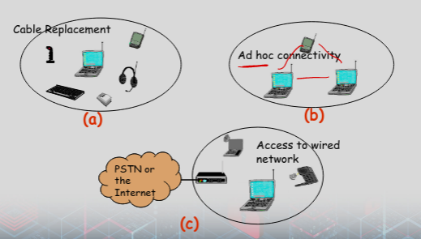
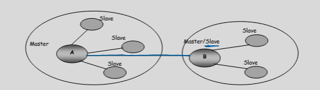

# Bluetooth

### Basics
- Made by swedish company
- 2.45 GHz
    - Originally used by industrial, scientific and medical devices
- Made for personal digital assistances 
    - no wire
- Defines stack from physical to app layers
 

 - Uses 

 

### Radio Specs
- 2.4GHz bands
- Frequency hopping
    - Channels are 1MHz wide
    - GFSK 
        - Gaussian frequency shift keying
- Time slot is 625 microseconds
    - Packet is in one, three or five slots
- Frequency changes for each packet

### Interference
- BWT devices hop randomly up 1600 times per seconds
- So if there is interference, it only loses 1/1600 of a second
    - Until many many devices in same area

### Device Address
- 48 bit MAC address
    - Bluetooth device address (assign to physical addr)
- This MAC address is split into three parts
    - The Non‐significant Address Part (NAP)
        - Used for encryption seed
    - The Upper Address part (UAP)
        - Used for error correction seed initialization
    - The Lower Address Part (LAP)
        - Used for FH(frequency hopping) sequence generation

### Connections
- Synchronous connection‐oriented (SCO) link
    - “Circuit‐switched – Voice data”
        - Periodic single‐slot packet assignment
    - Symmetric 64 kbps full‐duplex
    - Up to three simultaneous links
- Asynchronous connection‐less (ACL) link
    - Packet data
    - Asymmetric bandwidth
        - Variable packet size (1‐5 slots)
        - Maximum 723.2 kbps (57.6 kbps return channel)
        - 108.8 ‐ 433.9 kbps (symmetric)

### Architecture
- Scattered Ad‐hoc topology
- A “cell” or “piconet” is defined by a Master device
    - The master controls the frequency hopping sequence
    - The master also controls the transmission within its piconet
- There is NO contention within a piconet
- There is interference between piconets
- A device can belong to several piconets
- A device can be the master of only one piconet (why?)
- A device can be the master of one piconet and slave of another piconet or aslave in different piconets

- The Master device is the device that initiates an exchange of data
- The Slave device is a device that responds to the Master
    - Slaves use the frequency hopping pattern specified by the Master
    - A slave can transmit ONLY in response to a Master
- A Master device
    - Can simultaneously control seven slave devices
    - Might have up to 200 active slave devices in a piconet

### Power Control
- Three classes
    - 1: 100 mW (20 dBm)
    - 2: 2.5 mW (4 dBm)
    - 3: 1 mW (0 dBm)
- Can mix classes in a piconet
- Mandatory power control is implemented
    - Steps of 2dB to 8 dB
    - Only required amount of power
    - Based on feedback 

### Security Intro
- Bluetooth has support for authentication and confidentiality
    - Authentication uses challenge response
    - Confidentiality uses a stream cipher for encryption
- Key exchange stated as needed
- Modes
    - 1: no security, optional auth
    - 2: service level security
        - Channel or service decides if security is needed
        - Link level comms is first established prior to security
    - 3: Link level security
        - Link level connection is not set up unless security process is completed first

### Trust Levels
- Trusted Devices
    - These are “paired” or “bonded” devices that share PIN numbers and keys
    - They are included in a database and marked as trusted
    - Such devices are provided unrestricted access to services
- Known Not Trusted Devices
    - They are “paired” or “bonded”, but not marked in the database as trusted
    - Access to services may be restricted
- Unknown devices
    - No security information is stored
    - Device is essentially not trusted and access to services is restricted
- This is not part of the specifications, but only a suggestion

