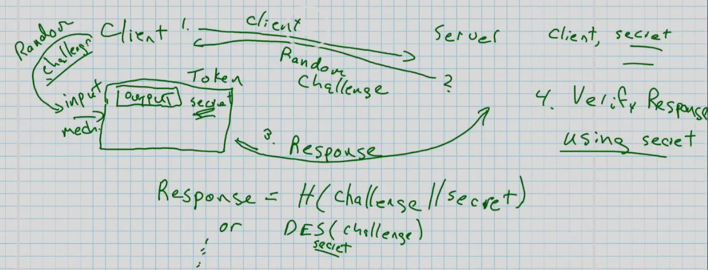
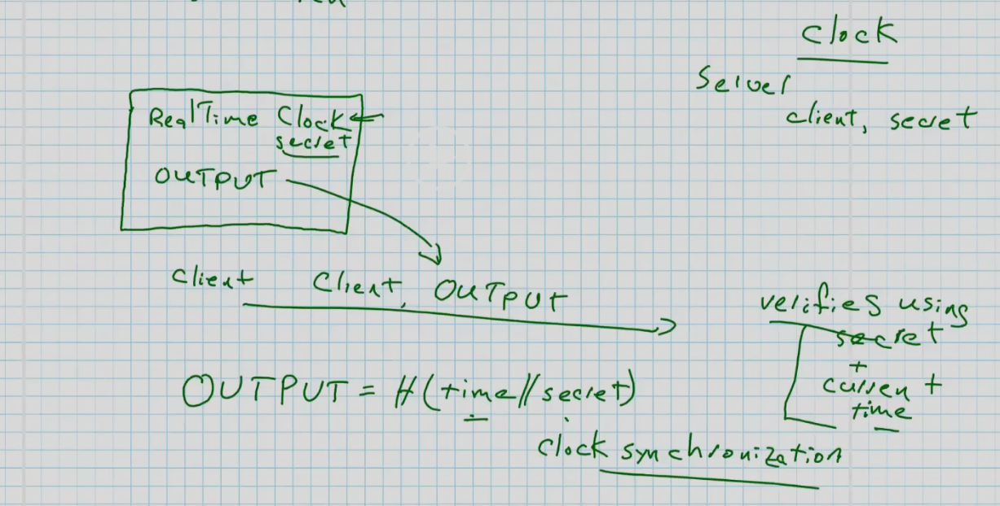
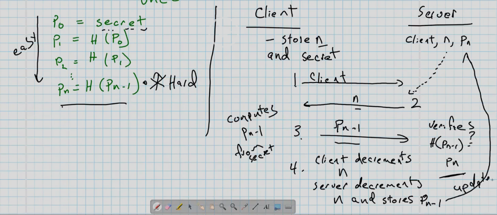

# Other Authentication Methods

### Physicial Tokens
- Physical keys
    - Not much entropy 
- Smart Cards
- Okta App
- Yubikey
- Pager with OTP
- All are something you **Have**
    -  Possession

### Challenge Response Token/Protocol
- Server knows client secret
- Client/User has device with keyboard w/ lcd
    - Device knows secret

- Client sends request to server
- Server gives random challenge
- Pass challenge to device (called token)
    - It does operation to random challenge
    - Could be hash(chall + secret)
    - Encrypt challenge with secret as key
- Send back to server
- Server verifies using secret
- Could also use PKI 

### Time Based Token
- Server knows client shared secret
- Token device now is just real time clock, secret, and output
- Client simply sends output from device 
- Server verifies using it with current time
- output ideas
    - H(time + secret)
- Issue is that devices need synced clocks / times

### One Time Password
- List of passwords
    - Each can only be used once
    - Scratch them off after use
- $P_0$ = secret
    - $P_1$ = H($P_0$)
    - until $P_n$
    - May only be the first chars of a hash
- Going up hash chain is hard and easy going down
- Server only needs to store client, n, and $P_n$
- Client knows n and secret

- Client request
- Server returns n 
- Client responds with $P_{n-1}$ using the secret
- Server verifies by hashing $P_n$
- Client decrements n
- Server decrements n and stores $P_{n-1}$

### Multifactor Authentication
- Using many forms when authenticating
- What you have, what you know, what you are
- have == token
- know == password
- are == biometrics

- Form of separation of privileges
    - Saltzar + Schroeder
