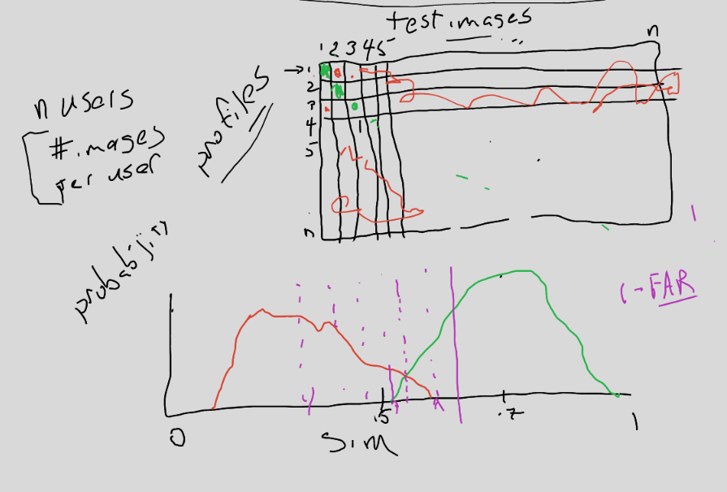

# Biometrics

### Base Knowledge
- What a person/subject is?
- Takes some measurements 
    - "image" of 
        - face geometry
        - fingerprint
        - iris
        - retina
        - hand geometry
        - voice
        - gait
        - blood?
- System "enrolls" a subject to create a profile
    - many images
    - doesn't store images typically
        - easy to 3d print/remodel a finger from images
    - some list of features found during enrollment
        - "unique" == specic to a subject 
        - stable over time
    - Failure to enroll error
        - Some people may not be able to use it
        - Ethical consideration with racial bias is here

- finerprint
    - capacitor / where your finger touches the glass change capacity 
        - Finger cause interference
    - camera reading light from where finger touches glass 

### Biometric Measurements vs Passowrds
- Passwords 
    - No noise minus user mistake

- Biometrics
    - Noise and variance
        - position and angle
        - pressure
        - lighting
        - dirt
        - sensor noise 
    - Change measurements 
    
### New Biometrics
- Most of work 
    - Taking images and making a profile
    - stable and identifying features

### System Characteristic
- System has list of (userid, profile)
    - Enrollment process
        - (im1, im2, ...) ==> profile
    - Similarity function
        - sim(profile, image) ==> 0% =< x =< 100% 
        - compares image to profile in algorithm
    - Authentication
        - auth(userid, image)
        - Look up userid profile and compare to image w/ sim()
        - Auth when sim() > threshold

### Evaluate Biometric system
- Accept - Auth successfully
- Reject - Reject Request
- Error rates
    - Fails to Accept / Rejects incorrectly
    - Accepts incorrect biometric / Fils to reject

# More Biometrics

### Box Diagram

- 2x2 of Action taken and the truth
- Truth == correct biometric given or not
- Action == Accept or Reject

- Perfect world
    - Only Accept when given correct bio
    - Only reject when incorrect

- False Reject
    - Correct rejected
    - Inconvenient
    - FRR = Num of false rejects over number of should accepts
    - FR/ShouldAccept

- False Accept
    - Incorrect accept 
    - Scary security issue
    - FAR = Num of false accepts over number of should rejects
    - FA/ShouldReject

### Profile Testing

- N profiles to n test images
- Some number on green diagnol is a false reject
    - Correct user test image to profile
    - Some of those will fail and to be counted
- Some number of orange false accepts
    - Incorrect user to profile
    - Count those

- FRR is harder to be accurate
    - Only n possible cases
- FAR is easier as in n squared

### Similarity score
- Setting threshold to get FAR and FRR values
- Create histogram of similarity threshold for both FRR and FAR
- Can see what is getting authenticated and how many false rejects and accepts 
- Bottom graph in above image
- All to right of thresh is accepted 
- All to left is rejected

