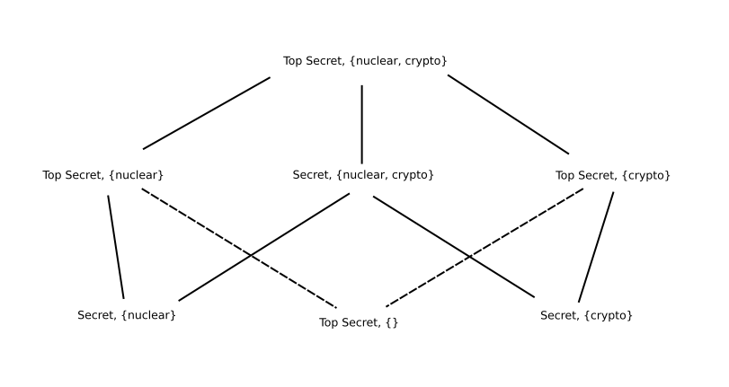

# Access Control

### Policy Models
- Formal way of deciding what an access control policy is

### Bell-LaPadule (BLP)
- Military confidentiality model
- Rather lose information than have it leak

- Subjects have clearances
    - (level, {categories, ....}) 
    - level == unclassified, confidential, secret, top secret
    - categories == labels that describe what the subject needs to know

- Objects have classification
    - (level, {categories, ....}) 

### Simple Security Property
- Reading
```
a subject, s, can read object , o, 
    iff s.level >= o.level
    and s.categories >= o.categories (o.c is subset of s.c)
    plus discretionary access control applies
```
- all categories of object are in subjects clearance

### Dominates
```
A dominates B
    iff A.l >= B.l
    and A.c >= A.c
```
- Partial order

### Star Property
- Writing
```
A can write to be B
    iff B dom A
    and DAC applies
```

- Can read below 
- Can write above

- Information can flow up to more secret class
- Not downward


### Latice 



### Secure State
- As long as the model is held up 
- In a secure state


