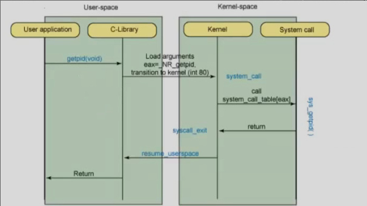

# Syscalls

### Review
- Rings 
    - Are instruction modes
    - Protects privilege instructions
- Memory
    - Virtual addresses
    - Each process looks up in table
    - No process shares same space
    - Managed by OS and MMU

### Syscalls
- Kernel at ring 0
- User at ring 3 
- System calls from application at user level to the kernel 
- allows access to other privileged actions

- Simple program
- ring 3, pid,
- eip 
    - pointer to instructuion running

- getpid
    - user app reaches getpid()
    - jump into C library (still ring 3)
    - libc preps as user mode and jumps to kernel
        - syscall handler

### Strace
- System call tracer
- shows output of all system calls made by a program

### IBM showing syscalls

- Kernel and libc has table to look up number to which system call 
- Jumping gap (gain privileges) kernel looks up value sent from libc
- Does corresponding system call in handler
- For getpid() kernel needs to write back to userspace with return value

### Adding syscall
- asmlinkage 
- macro of \_\_user so pointer is not derefereded in kernel space
    - it is a user pointer (presult)
- example gets jiffies (small internal kernel time)
    - returns difference of current jiffies 
    - put_user(result, presult)
        - puts the difference in the user memory
        - keepa track of previous user memory space syscall came from

