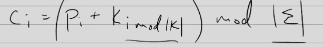

# Cryptography

### Vigenere Continued
- Algorithm for any alphabet
- Sigma is the alphabet

- How to attack it
    - Frequency Analysis
        - Break it into columns 
        - Analysis the columns
        - They are all the same encrypted the same
        - Same action done 

### Sidebar General Substitution 
- A -> D, B -> Y ... randomly
- Number of keys
    - 26! or factorial
    - 4 * 10^26
- How to attack
    - Wheel of fortune technigue
        - Letter frequency
        - Not obfuscating plaintext message
    - Same characters has small plaintext it could be
        - They are looked up the same in table
        - ee, ss, tt, ...

### Vignere Index of Coincidence
- Counts frequency in cipher text
- Sum of repeating a pair
    - $\sum_{i=A}^{Z} {c[i]} / {n} * {c[i] -1} / {n-1}$ 

