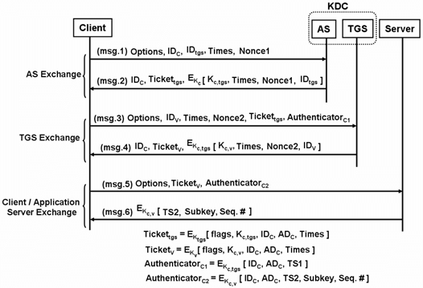

### Terms
- Sym Enc
    - Same key encrypts and decrypts
- Asym Enc 
    - Different Keys encrypt and decrypt
    - Public key

### Key Exchange
- Goals
    - Alice and Bob can agree on a key known only to them
    - No one else has info on the key
    - Should trust who they are talking to 
        - Authenticate each other
    - Told of a secret fourth idea

### Bad KX example
- Manually hand out key to each person you know
    - All pairs
    - Not scalable
- Table 
    - N x N
    - Diagonal is self
    - Bottom of diagonal is repeat key
    - (n^2 - n) / 2
    - OR n/2 * (n-1)
    - 870 / 2 for N == 30

### Trusted Third Party Protocol
- Kerberos
    - 80s MIT
- AS / Authentication Server
- TGS / Ticket Granting Service
- S / Service

- **Time Diagram**
- Client Sends identity to AS, with time and nonce
    - Nonce and time prevent replay
- AS returns ticket and encrypted message in $K_c$
    - $K_c$ shared between client and AS
    - Client can decrypt and check info sent in message
    - Gets key $K_{c,tgs}$
    - What is in the ticket
        - Encrypted message for TGS 
        - Client can't read it but is passed to TGS 
- Client sends ID for service, Time, Nonce, ticket, and encrypted message to auth with TGS
    - TGS decrypts ticket and gets key to decrypt auth message
    - Can then confirm matching infromation 
    - Returnes ticket for service and encrypted message with key for auth message to service
- Client Sends ticket to service with auth message
    - Service decrypts tickets and gets auth message key
    - Can then confirm client
    - Returns Sequence
    - Client can now send / access client using kerberos with $K_{c,v}$

### Kerberos Scary
- Trusting KDC for all authentication 
    - Get access then you can just issue tickets for whatever you want
- Single point of failure
- Not scalable across the internet 
    - Trusting centeral place with passwords

