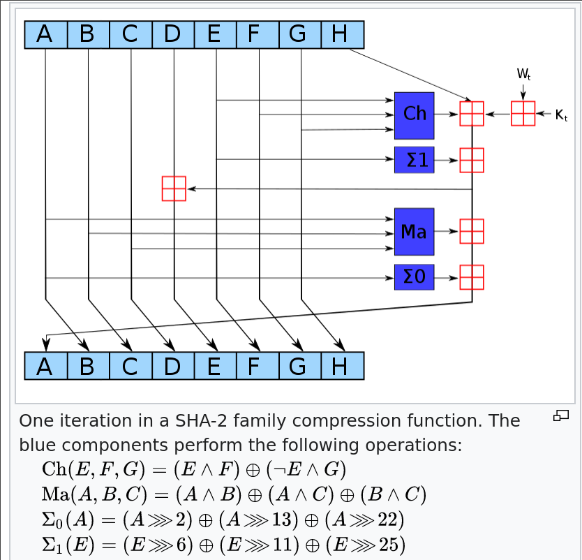
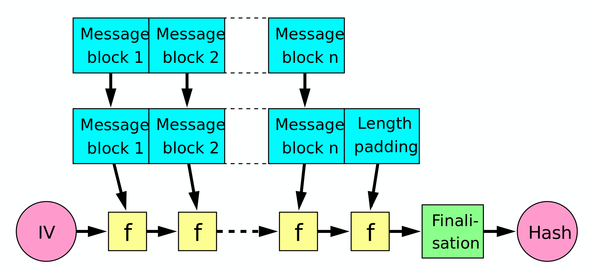

### Hash Functions
- Sha256 round

- Compression function

- Davies Meyer compression function

### Digital Signatures
- Bad Sign(M, d) = {M} encrypt with priv key
- Good sign (M, d) = H(M) encrypt with priv key
- Verify(E, m', e) = {E} decrypt e and compare with H(m')
    - E = signature
    - e = pub key
    - if match, m' is verify from sender and unchanged
        - Authenticity and integrity

### Basic Cert
- Subject
- Issuer
- Pubkey subject
- Valid time range
- Signature by Issuer private key
