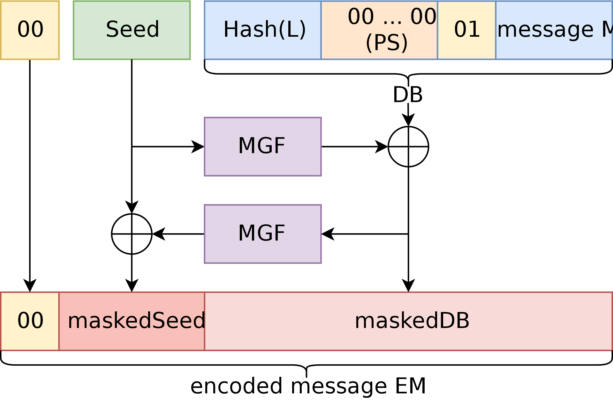

### Padding 
- C = $pad(m)^e$ mod n
- reservible function
- randomized

### Optimal Asym Enc Padding

- Message
    - Original message
    - 01 and rest zeros in front
    - Hash of label     
- Seed is nonce 
- MGF is one way function like a hash
    - Takes seed hash and xor to encode message
    - Takes encoded message hash and xor to seed
    - Get masked seed and message
    - Leading zeros
- Undoing pad
    - hash masked message and decrypt seed
    - then can do same to get message
- Fiestal

### One Off Hash function
- Practically Unlimited input size in bytes/blocks
- fixed out put size 
- SHA256
    - 256 bit output
- one way in practice

### Hashing Indepth
- Hash tables and sets in data structures
    - Not cryptographic
- Cryptographic
    - is above idea 
    - unlimited input and large limited out
- Security properties
    - Preimage Resistance
        - one way property
        - Given H(m), no fast way to find an m' such that H(m') == H(m)
        - Pigeon hole / 2^800(100 bytes) goes to 2^256 and much larger messages
        - Technically infinite messages map to same hash
    - Second Preimage Resistance
        - Given m, H(m), find m' not equal to m that H(m') == H(m)
        - Must be difficult
    - Collision Resistance
        - Difficult to find m and m' that H(m') == H(m)
        - Two different message that hash to same
        - Look up table (2^(2^256))

### Breaking Collision resistance
- Look up table and keep generating messages until a match
- Significantly smaller than going through half possible for other properties
- L hash values
- K messages
- $P_K$ is probablity of none sharing hash value
- $1 - P_K$ is probablity of two or more sharing
- When is $P_K$ down to half
    - K == 1, $P_K$ is 1 
    - K == 2, $P_K$ = (L-1) / L
    - K == 3, $P_K$ = (L-2) / L
    - (L-(K-1))/L
    - K is sqrt(L), $P_K$ is 1/2

