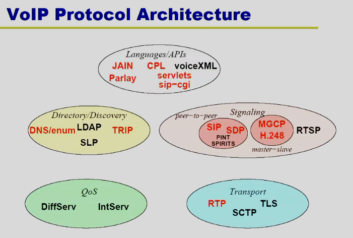
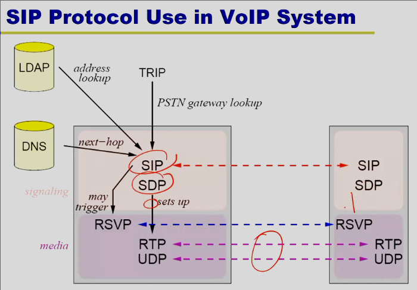

# VOIP

### VOIP phones
- Have Voice IP
- Make threatening calls utilizing VOIP
- Combine Anonymous services with VOIP 
- Stepping stones and VOIP

###  What a user does?
- Record date, time, message
- Can try caller ID
- Contact provider of service
- Contact police
    - File police report
    - Talk to investigator

### VOIP vs Phone
- PSTN
- Public switched telephone network
- In and out on one line
- ID matches number used for inbound
    - Controlled by phone company
- Info by company and easy to obtain

- VOIP
- No central place like switched network
- Can have different providers for in and out
- Alter caller ID before and after call
- Scammer doesn't need a call service
    - Set PBX to any caller ID

### SIP
- Main VOIP protocol
- Audio and Visual
- On TCP and UDP
- Audio and Visual send over UDP
- Establish with TCP

### Protocol

- Directory / Discovery
    - Parts about finding users
    - Knowledge of the users

### SIP Addressing
- Uses email styling addresses
- Typical just the email
- Written as URL, sip: alice@example.com
- Add parameters such as type or transport protocol
- Can convert emails to different phone numbers
    - Based on parameters like time of day
    - Attacker could utilize this to make ID not route back 
        - My thought

- Back to Back UA
- Two user agents where incoming calls trigger outgoing calls to somebody else
- Call someone when not available
    - Sends back OK when they are
    - Used for anonymity

- Can redirect to other number
    - when say office phone not available

- Other features
    - Outbound Proxy
    - Phone to VOIP

- Proxy Mode (Domain Recieves Message)
    - Like Email
    - Public server recieves messages coming to the domain
    - Translates public email/ID to internal
    - Establish connection between the internal and external caller
    - Proxy may redirect to another domain 
        - Moved temporarily to another domain
        - Tells callers to try their new email/ID
    - Location servers can be queried to determine which address to call frist as well

- Utimately seems to ack a lot like email
    - more physically connected to the world
- Has Call-ID field with From and TO
    - Can be filled with anything to impersonate

- Request Forking
    - Try all machines at once
    - which picks up will be the one established
- Call Trnsfer
    - Allows for anonymous calls
    - Caller knows who they are called from
    - Callee only sees who they redirected from
    - Third party knows both

- SIP Security 
    - Can Use IPSEC or TLS
    - Password request
    - Preshared secret
    - Certificates

### Tracking Anonymous Calls
- Watermark technique
    - P2P and encrypted
    - Even if anonymous
    - Just like IP
- Correlating both ends of traffic
    - Internal networks don't matter
- Timing tracking
    - Can find pairs of the correlated 
    - embedding watermakers to track timing
    - Get distance 
    - Determine they are the same phone call
    - Calls at least 90 seconds long
        - 140 milliseconds delay assumed for getting enough packets

