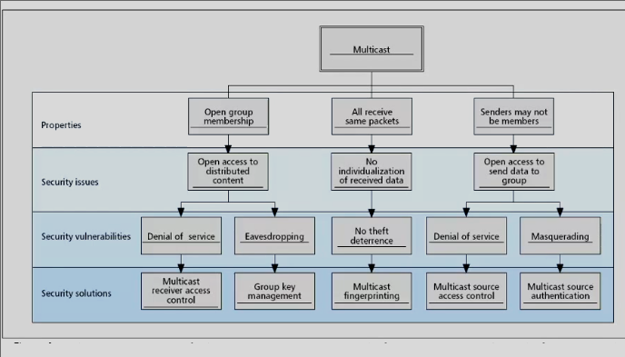

# Multicast Fingerprinting and Multimedia Forensics

### Multicast
- One sender to multiple recievers
- Determine which device was the sender

- Enables large-scale content distribution
    - One to many or many to many
- Properties:
    - All members reciever all packets sent to the address
    - One group membership: Transparent to source
    - Open acces to send packets to the group

### Fingerprinting
- No individualization of the received data
- Watermarking schemes won't work
    - Can't determine leaker
- Requirements
    - Collusion problem
        - Multiple people that is a colluded copy 
        - Change watermarking
    - Protection granularity

### Multicast Watermark
- Embed watermarks step by step through process
- During multicast split, embeds different value
- Can see where it splits 
- Each reciever gets different value
- When information is leaked by person
    - Know by comparing fingerprint in leaked one
- Could generate colluder versions to catch colluders
    - Not sure if both fingerprints would exist
    - Generated new version trying to remove fingerprints
    - Can try to get fingerprints from colluded version if they could not remove
    - Codebook of colluders

### Watercasting
- Send multiple copies 
- Few bits embedded
- Splits packets based on embedded information

### Motivations
- Post-delivery challenger
    - Content is no longer protected by AC
    - Recent advances in comms allow for convenient sharing of multimedia
    - Customers alter/redistribute content
- Watermark for mulitmedia content 
    - Crypto not enough
    - Watermark seamlessly embeds side info in the host data
    - Applications: ownership protoection, copy control, authentication
- Exploit data embedding beyond resolving copyright dispute and covert comms

### Multimedia Forensics
- Leak of information poses threat to gov or commercial activities
    - Pirating / classified info
- Promising countermeasures
    - Embed digital fingerprints (Robust)
    - Insert ID for each user
    - Deter leaking
    - Challenger: imperceptibility, robust, tracing

### Embedding
- Can't do too much for the quality of media
- Blind and non-bind detection
    - blind means not comparing against the original unmarked media
- Kerckhoff == security must rely in the key

### Collusion Copy
- How to determine colluders
- Recovers finger print that doesn't match any user 
- Average attack
    - Average pixel value for each pixel 
    - Scale depends on the media (to my view)
- Minimum
    - Take smallest
- Maximum
    - Take largest
- Min/Max attack
    - Combine the above
    - Needs more that 2
    - Average of the min and max values
- Randomize Negative attack
    - Set the value to the minimum value with probabily p
    - Otherwise use the maximum
    - Set P to what ever probability
    - Random

### Problem / Solution
- Determine number of colluders and the attack
- Don't need complete fingerprint
- Set is from oversvations and not test predictions/combinations
- Independent of the attack
- Generate the correlation 
    - compare each users variant of media
- Use a variant of a K-means algorithm
    - 2 means

