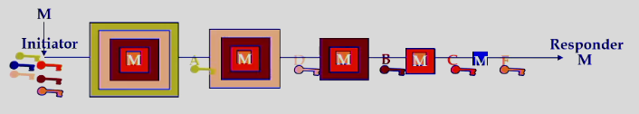

# Anonymity and Psuedonymity

### Motivation
- Protect id of participants in distributed applications 
    - Eshopping, voting, cash
    - Military
    - Criminal activity as well

### Pentagon Pizza 
- Commerical routers not under gov control 
- Unencrypted data in completely open
- Encryped dat exposes parties

### Traffic Analysi attack
- Public networks are vulnerable
- Reveals identities
    - Who is talking to who
    - Web sites being surfed
    - Agencies collaborating
    - Email correspondents
    - What are you ordering

### Goals
- Hide
    - Sender activity
    - Receiver activity
    - Sender content: meaning specific activity
    - Receiver content: meaning specific activity
    - Source destination linking: source is sending to particular location
    - Channel linking: endpoints of a channel

### Anonymizing Channels and Data
- Channels: prevent channels from identifying communicants or traffic properties
- Data: prevent application data on channels from IDing communicants or properties
- Anon channel but not data
    - Anonymous but authenticationed remote login
- Anon daya without anon channel
    - Removing identifying infor from HTTP connection 
- Focus in anon channels

### Anon Comms Systems
- Anonymizer 
- Anonymoous Remailer
- Crowds
- Freedom
- Hordes
- Onion-Routing
- PipeNet
- SafeWeb

### Basic Approach: Anonymizing Proxy
- Channels appear to come from proxy and not originator
- May also filter traffic for identifying info
- Sitill going through ISP
- ISP knows users connection times/volumes
    - Can eavesdrop on outgoing proxy connections and learn all
    - Timing attack
- Proxy knows everything about all connections
- Both are fully trusted single points of failure

### Chaum Mixes
- Idea for mixmaster remailer, TOR, ZKS freedom
- Basic Idea:
    - Cell wrapped in multiple layers of pub key encryption by sender
        - One for each node in route
    - Decrypted layer tells mix next node in route
    - Mixes hold different cells for a time 
    - Reorders before forwarding to destination
- Mix Options
    - Basic Routes
        - Cascade
            - All cells from any source move through a fixed order cascade of mixes
        - Random Route
            - Route of any cell is selected at random by sender from available mixes
    - Basic Flusing: (Reording and forwarding cells at a mix)
        - Threshold Flush
            - Mix flushes all cells whenever a thresdhold number of received cells is reached
        - Pool Flush
            - Mix flushes each cell with prob (p) 
            - When a threshold pool size of received and existing cells is reached
        - Time slice
            - Mix flushes all every (t) seconds
        - Stop and Go
            - Sender Chooses random time for cell to be held at each mix

### Remailer 
- Used to be proxy
- Know also based on mixes

### Crowds
- User machines are the network 
- Blender annouinces crows members to all members
- Jondo at machine flips weighted coin
    - Heads to random
    - Tails to end web machine (destination)
-  All jondos know path key
    - Only 2 machines they connected to as well
- All connections from a source use same path for lifetime of that crowd

- Limitations
    - Users must use perl
    - Need high spped internet
    - Entirely new network graph for reconnecting crowd member
    - Connection anonymity depends on data anonymity
    - Limited by crowd size
    - Not suitable for enclave protection
    - Weak or no responder protections

- Strengths
    - So single point of failure
    - Sender protections
    - Lightweight

### Onion Routing
- Initial proxy knows the onion routing network topology
- Selectis route and gens onion
- Each layer of the onion identifies the next hop in the route
    - contains the crypto keys to be used 

- This is the idea from Mixes

### Dining Cryptographers Networks
- Someone has paid the dinner for you
- Everyone flips a coin
    - Can see yours and one to the left
- Compare difference
    - Say diff or same
- If someone at the table paid the bill
    - They lie and say the opposite
- In three person example
    - Number of differents is odd 
        - means someone at the table paid
    - if even 
        - Someone external did
- Unconditionally secure if carried out faithfully
- Cannot learn which of the others paid
    - Fair coin is hidden 

