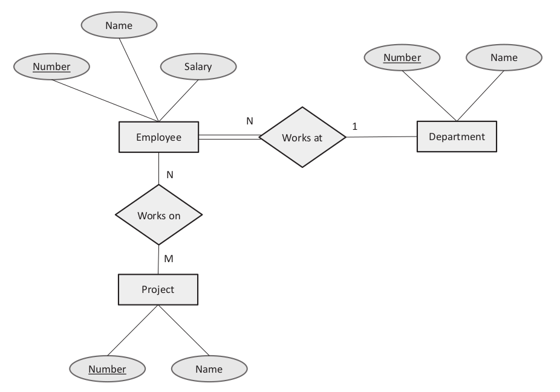

# Relational Databases

### Concepts
- Relations 
    - Set of tuples (rows)
    - DB has table of relations or tuples
- Schema
    - Each relation has fixed set of attributes (columns)
    - Constaints on each attribute
- Tuples
    - All tuple in relation has same attributes
    - Tuples in relaiton have any order
- Attributes
    - Has domain, set of possible values
- Insert Update and Delete
    - Relations can be modified 
    - Each relation has a primary key that uniquely identifies each of tuple
- Primary Key
    - Attribute can be made a primary key if it does not repeat in different tuples
    - Unique ID

### Guarantees
- Atomicity
    - All or nothing
    - Entire transaction is applied or none of it
- Consistency
    - Goes from one valid state to another
    - Always conforms to schema and constraints
- Isolation
    - Concurrent and serial transaction have same outcome
    - I do 100 at once is same as doing each after one another
- Durability
    - Data remains as it is after a transaction
    - Failure does not lose at failure like power
    - Can recover from abnormal trnasactions

### Categories
- Online Transaction Processing (OLTP)
    - eCommerce where everything is transactions
    - High volume of IUD
- Online Analytical Processing (OLAP)
    - Data warehouses
    - Analysis for business decisions
    - Lower volume of IUD but more complex use of data

### Widely Used RDB
- MySQL

### Entity Relationship Diagram

- Maps to databases
    - Rectangle is entity table
    - Oval is field in entity table
    - Diamond is relationship table

### Amazon RDS
- PaaS 
    - Don't care about underlying system
- Many types of SQL
- Multi-AZ (Availability Zones)
    - Cluster
    - Reduncdancy (second instance)
    - Syncing between
    - Auto failover
- Scaling
    - Vertically
        - Scale-up or down depending on workload
    - Horizontally
        - Sharding / create db amoung multiple instances
        - Writes go to primary
        - Reads from replicas

### Amazon Redshift
- Massive scale fully managed data warehouse
- OLAP
- Massive parallel processing
    - Parallelize queries across all resources
- Columnar storage and compress
    - Fast search on keys
- Distribution
    - cluster w/ each db having multiple tables
    - Node is partitioned into slices, each slice is part of memory and disk
    - Leader node manages data to slices
- Distribution Strategies
    - Even, rows are split across slices in round robin
    - Key, rows are split based on values in one column
    - All, full copy to each node

### Amazon ElastiCache
- Managed service to launch, manage, and scale distributed in-memory cache
- Redis and memcached
- improve preformance

